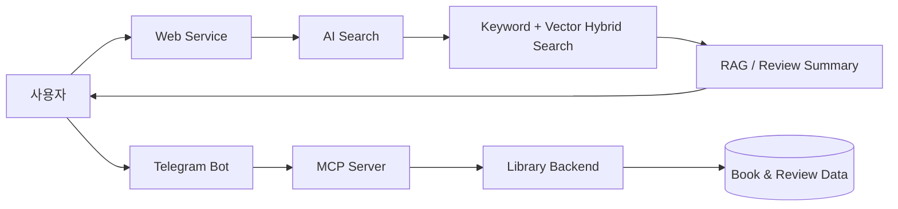

# 📚 AI Library Platform

<b>자연어로 찾고, AI로 이해하는 도서관</b>

AI Library Platform은 도서관의 책과 리뷰 데이터를 AI 검색 기술과 연결한 도서 검색 서비스입니다. 사용자가 원하는 책의 분위기·주제·상황을 자연어로 설명하면, 키워드 검색과 벡터 검색을 결합한 Hybrid 검색으로 관련 도서를 찾습니다. 검색된 도서 데이터는 RAG에 활용하고, 여러 리뷰의 핵심 내용은 AI가 요약합니다.

웹 서비스가 핵심 검색 경험을 제공하고, MCP Server와 Telegram Bot을 통해 같은 도서관 기능을 AI 에이전트와 메신저 환경으로 확장했습니다.

## 핵심 기능

| 기능 | 설명 |
| --- | --- |
| 자연어 도서 검색 | 원하는 책을 일상적인 문장으로 설명해 검색합니다. |
| 벡터 검색 | 의미적으로 가까운 도서를 찾습니다. |
| Hybrid 검색 | 키워드 검색과 벡터 검색을 결합합니다. |
| RAG | 검색된 도서 데이터를 바탕으로 답변을 생성합니다. |
| 리뷰 요약 | 여러 리뷰의 핵심 내용을 요약합니다. |
| MCP 연동 | 도서관 기능을 AI 에이전트가 사용할 수 있는 도구로 제공합니다. |
| Telegram Bot | Telegram에서 자연어로 도서를 검색합니다. |

## 전체 구성

### Web Service
자연어·벡터·RAG·Hybrid 검색과 리뷰 요약을 제공하는 핵심 서비스입니다.

### MCP Server
도서관 기능을 AI 에이전트가 이해하고 호출할 수 있도록 MCP 도구와 연결 계층을 제공합니다.

### Telegram Bot
Telegram 대화만으로 도서 검색을 사용할 수 있도록 만든 사용자 채널입니다.

## 내가 구현한 파트

### MCP Server

- AI 에이전트와 도서관 백엔드 사이의 연결 구조 구현
- 도서관 기능을 MCP 도구로 노출
- MCP 코드와 도메인 기능을 분리해 도구 추가가 쉬운 구조로 구성

Repository: [Spring-Ai-Library-Team3-mcp](https://github.com/AIoT-3/Spring-Ai-Library-Team3-mcp)

### Telegram Bot

- Telegram Open API를 이용한 봇 연동
- Telegram 메시지를 도서관 검색 흐름으로 연결
- 웹 화면 없이 대화형으로 도서 정보를 받을 수 있도록 구현
- 월별 키워드와 같은 확장 기능을 Telegram 채널에서 제공

Repository: [Spring-Ai-Library-Team3-telegram](https://github.com/AIoT-3/Spring-Ai-Library-Team3-telegram)

## 구현에서 중요하게 생각한 부분

### 기능보다 연결 구조에 집중
MCP Server와 Telegram Bot은 기존 도서관 검색 기능을 다른 인터페이스에서도 재사용할 수 있게 만드는 역할을 합니다. 웹·AI 에이전트·Telegram이 서로 강하게 묶이지 않도록 각 계층의 책임을 나누는 데 집중했습니다.

### 자연어 사용 흐름 유지
사용자는 내부적으로 어떤 검색 방식이 사용되는지 알 필요 없이 원하는 책을 말하면 됩니다. 웹이든 Telegram이든 검색 요청이 자연스럽게 도서 검색 기능으로 이어지도록 사용자 경험을 단순하게 유지했습니다.

### 확장 가능한 도구와 채널
MCP 도구는 새로운 AI 기능을 추가할 수 있는 기반이고, Telegram Bot은 도서관 기능을 다른 사용자 접점으로 확장하는 기반입니다.

## 기술 스택

    

## 관련 링크

- [Web Service / Library Backend](https://github.com/AIoT-3/Spring-Ai-Library-Team3)
- [MCP Server](https://github.com/AIoT-3/Spring-Ai-Library-Team3-mcp)
- [Telegram Bot](https://github.com/AIoT-3/Spring-Ai-Library-Team3-telegram)
- [Design Report](https://www.miricanvas.com/v2/ko/design2/05a8a803-b46f-4874-a3ef-3c4eadc7899e)
